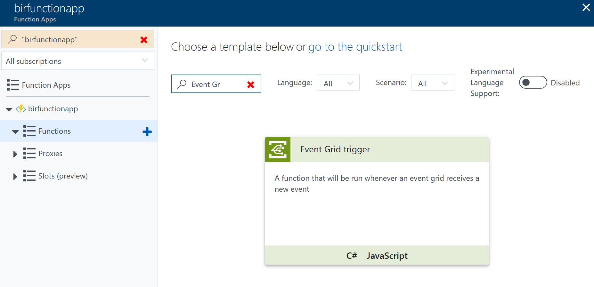
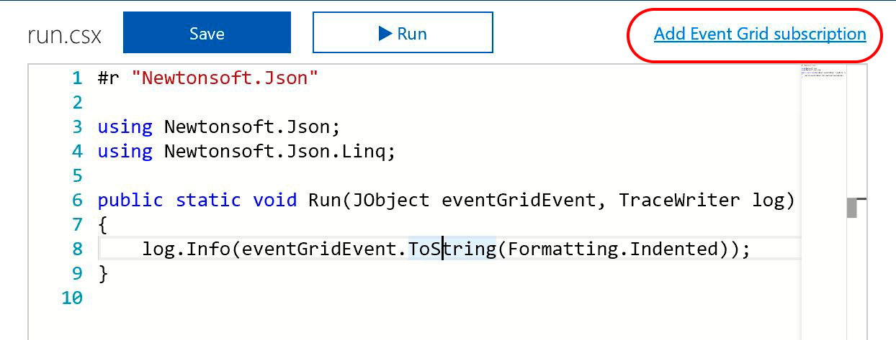

---
Title: Azure Event Grid Nedir?
PublishDate: 13/2/2017
IsActive: True
MinutesSpent: 157 
Tags: Azure Event Grid, Eventing, Azure Functions
---

Hiç webhook açmak zorunda kaldınız mı? Veya şöyle sorayım; hiç size ait olmayan, harici bir HTTP Endpointi belirli bir olay gerçekleştiğinde iteklemeniz gerekti mi? :) Peki itekleyemeyip, sonra tekrar denemeniz gerekti mi? Peki böyle bir altyapı oluşturup milyonlarca farklı yeri, milyonlarca defa, hatta hata durumunda tekrar deneyebilecek şekilde iteklemeniz gerekti mi? "Yahu bu bildiğimiz pub/sub?" diyorsanız doğru yolda sayılırız. Gelin devam edelim. 

Özellikle Serverless'ın popülerleşmesi ile beraber event based uygulamalardaki eventlerin tabiri caiz ise cloud eventlerine dönüşmesi giderek hızlanıyor. Azure'daki bir uygulamada oluşan durumla gidip AWS'deki bir uygulamayı tetiklemeniz gerekebiliyor. Bunu yaparken AWS'deki uygulamanın hayatta olduğunu da varsayamazsınız, çünkü burası Cloud, her şey olabilir :) Azure Event Grid'in çözdüğü problem de bu. Uygulamalar gelip "Subscribe" olduktan sonra Event'ler doğrudan uygulamalara Azure Event Grid tarafından gönderiliyor. **HTTP200 veya 202 dışında** bir cevap geldiği anda Azure Event Grid söz konusu eventi teslim etmeyi tekrar deniyor. 10 saniye, 30 saniye, 1 dakika, 5 dakika, 10 dakika, 30 dakika, 1 saat... Bir saatten sonra tekrar birer saat ara ile denemeler devam eder. Deneme süreleri arasında ufak rastgele zaman aralıkları da var, yani nokta atışı beklemeyin. 24 saat içerisinde bir event teslim edilemezse silinir, iptal edilir. **1 milyon event operasyonu için 0.60$** ödersiniz. Bu operasyon sayısına tekrar denemeler de dahildir. Azure Event Grid budur :)

### Eventin hangi tarafındasınız?

Bu noktadan sonra Event Grid ile ilgilenme şekliniz aslında Event'in hangi tarafında olacağınıza göre değişiyor. Event alacak olan taraftaysanız (Handler) size verilecek bir endpointe subscribe olmanız gerekecek. Bu konuda da eğer elinizde özel olarak custom bir publisher (event yollayan) yoksa Azure içerisindeki implemantasyonlara göz atabilirsiniz. Azure kendi içinde de Event Grid'i kullanıyor ve çoğu hizmetin zaten Event Grid entegrasyonu var. Aşağıdaki grafikte de görebileceğiniz üzere default Azure Publisher'larından herhangi birine gidip subscribe olabilirsiniz. (Custom Topics konusuna sonraki bir yazıda bakacağız)


Eğer aldığınız eventi yine Azure içerisindeki bir hizmete aktarmak isterseniz bunun için de hazır handler entegrasyonları var. Yine yukarıdaki grafikte sağ tarafta platform ile beraber gelen Handler'ların listesine bakabilirsiniz. Örneğin bir blob yaratıldığında Azure Function çalıştırmak istiyorsanız Event Grid süper doğru bir tercih olacaktır.

### Azure Function mı? BlobTrigger vardı ya? Neden Event Grid?

Azure Functions ile hiç uğraşmamış olsanız da bu bölümü atlamayın :) Çünkü bir anlamda Microsoft'un neden Event Grid diye bir şeyle ortaya çıktığını anlamak için güzel bir örnek olacak. 

Azure Functions içerisinde BlobTrigger denilen bir yapı var. [Hatta ben bu yapıyla ilgili de 2016'da detaylı bir yazı yazmıştım](http://daron.yondem.com/azure_functions_ile_blobtrigger_kullanmak). Functions SDK içerisindeki BlobTrigger ile bir Blob değiştiğinde Function'lar tetiklenebiliyor. Fakat BlobTrigger aslında kendi logunu tutarak, polling yaparak çalışıyor. Zaten eski yazıda da bahsetmişim, çok sayıda blobun olduğu senaryolarda QueueTrigger vs kullanmak daha iyi oluyordu. İşin güzel tarafı Event Grid kullandığınızda artık sizin  polling yapmanıza gerek kalmıyor yok, execution log tutup onu incelemnize de gerek yok. Event Grid kendisi gelip Function'ınızı tetikleyebiliyor. Yani eskiden Event Grid olaydı Azure Function ekibinin BlobTrigger yapısını yazmasına falan gerek kalmayacaktı :) 

### Azure içinden Publisher ve Handler Kullanmak

Gelin hızlıca yukarıdaki senaryonun Azure'da nasıl çalıştığına bir göz atalım. Bunun için bir Azure Function App yarattıktan sonra içine basit bir Function koyacağız. Amacımız bu Function'ın Event Grid entegrasyonunu kullanarak Publisher olarak ayarlayıp istediğimiz Storage Account'tan gelen eventleri karşılamasını sağlamak. 



Yukarıdaki ekran görüntüsünde de görebileceğiniz üzere ben Azure Functions sitesinde template'lardan hazır olarak gelen Event Grid Trigger'ı seçtim. Çok önemli bir detay değil bu, beraberinde getireceği sadece metod imzasında iki tane hazır parametre.



Gelen kod yukarıdaki kadar. Sağ üstte gördüğünüz "Add Event Grid Subscription"a basarak ilerleyeceğiz. Bunu yapmadan önce Event Grid desteği olan V2 bir Azure Storage hesabınız olması gerekiyor. Eski Storage Account'larda Event Grid desteği yok.


Yukarıdaki ekran görüntüsünde tüm gerekli ayarları görebilirsiniz. Anlatılması gerekenlere gelirsek;

- **Topic Type**: Tabi Storage Account dinleyeceğimiz için bunu seçtik.
- **Instance**: Bu benim storage account'un adı :) Çok yaratıcı :)
- **Event Types**: Burada Created ve Deleted'ları alabiliyoruz. Ben sadece Created seçtim.
- **Subscriber Type**: Event Hub veya Webhook olabiliyor. Azure Function için built-in Webhook desteği daha rahat oluyor diye düşündüm.
- **Subscriber Endpoint**: Buradaki endpoint [EventGridExtensions](https://github.com/Azure/azure-functions-eventgrid-extension/blob/master/src/EventGridExtension/EventGridExtensionConfig.cs)'dan geliyor. Event Grid'e subscribe olurkenki validasyon gibi konuları bu extension hallediyor ve bizim Function içinde uğraşmamıza gerek kalmıyor. Bu konuyu da ileriki bir yazıda Azure dışı handler kullanırken inceleyeceğiz.
- **Prefix Filter**: Sadece belirli bir containerdaki dosyaları işleyebilecek örnek bir filtre koymak istedim.
- **Suffix Filter**: Ben kullanmadım fakat ne işe yaradığı sanırım belli :) Blob URL suffix matching yapabiliyorsunuz.   

Azure Functions tarafında Event'i adam gibi deserialize etmek için de kodu aşağıdaki şekilde değiştirebilirsiniz:)   
   
```CS
#r "Newtonsoft.Json"
#r "Newtonsoft.Json"
#r "Microsoft.Azure.WebJobs.Extensions.EventGrid"

using Newtonsoft.Json;
using Newtonsoft.Json.Linq;
using Microsoft.Azure.WebJobs.Extensions.EventGrid;

public static void Run(EventGridEvent eventGridEvent, TraceWriter log)
{
    log.Info($"Subject: {eventGridEvent.Subject}");
    log.Info($"Time: {eventGridEvent.EventTime}");
    log.Info($"Data: {eventGridEvent.Data.ToString()}");
}
```

Şu EventGridExtension ve beraberinde gelen custom endpointten biraz daha bahsetmekte fayda var. Azure Event Grid'e herhangi bir endpoint kendini subscribe ederken aynı anda valide de etmesi gerekiyor. Bunun için  Event Grid subscribe olan tarafa bir **SubscriptionValidationEvent** gönderiyor. Bu normal eventlerden farklı bir event ve içerisinde **validationCode** var. Subscribe olan tarafın bunu alıp **validationResponse** olarak geri döndürmesi gerekiyor ki subscription oluşturulsun. Validasyon sürecinden geçildikten sonra artık karşı tarafa normal eventler gönderilmeye başlanıyor. Biz bunları Azure Function içerisinde sıfırdan yapmayalım diye Azure Function ekibi bir Extension yazmış. Tüm bunları sıfırdan nasıl yapacağımıza ileriki yazılarda custom subscriber oluştururken göz atacağız. 

### Polling'e son

Azure Event Grid gerçek anlamında pollingden kurtulmamızı sağlıyor. Bugüne kadar Azure içerisinde de Azure Function'lar olsun Logic Apps olsun birçok hizmet öyle veya böyle birbirleri ile konuşabilmek için polling yapıyordu. Oysa artık Event Grid ile pollingin maliyetinden ve kısmi gecikmelerinden kurtulmuş oluyoruz. Serverless tarafına baktığınızda ise eventing için kuyruk kullanma ve kuyruğu poll'lamaya süper bir alternatif. Tabi bu "kuyruk yerine artık Event Grid" gibi bir sonuç da çıkarmıyor :) Kuyrukların yeri ayrı, fakat artık eventing için kuyrukları kötüye kullanmaya gerek yok. Event Grid bugün saniyede milyonlarca eventi destekleyecek bir altyapıya sahip. En güzel tarafı ise bir event publisher'a birden çok subscriber da olabiliyor olması. Bir anlamda fan-out da yapabiliyorsunuz. 

### Fiyatlandırma

Azure Event Grid'in fiyatlandırması gerçek bir cloud hizmetinin fiyatlandırmasına çok güzel bir örnek. Hiç kullanmazsanız hiç ödemezsiniz. Provisioning vs yok. **Ayda 100.000 operasyon ücretsiz**. Bu kota yazılım geliştirme süreçlerindeki, test vs ihtiyaçlarınızı rahatlıkla karşılaşayacaktır. Azure Event Grid için bir operasyon demek gelen, giden event, servisle konuşmak için sizin kullandığımız management api'ları ve bir eventin teslim edilmesi için eğer gerekmişse farklı denemelerin toplamı anlamına geliyor. Unutmadan bir de bu "Advanced matching" var ayrı operasyon olarak kabul edilen. Bu da "subject pattern filtering", yani "Subject ends with" sorgusunu kullandığınızda geçerli olacaktır. 

### Son olarak...

* 99.99% SLA
* [Management SDK'leri Python, .Net, ve Node.js](https://docs.microsoft.com/azure/event-grid/sdk-overview)'leri için şu an yayında. Go, Ruby, ve Java SDK'leri ise yakında gelecek. 
* [Publish SDK için şu an .Net desteği var](https://docs.microsoft.com/azure/event-grid/sdk-overview). Python, Node.js, Go, Ruby, ve Java yakında gelecek.   
   
Şimdilik bu kadar :) Sonraki yazılarda görüşmek üzere.


